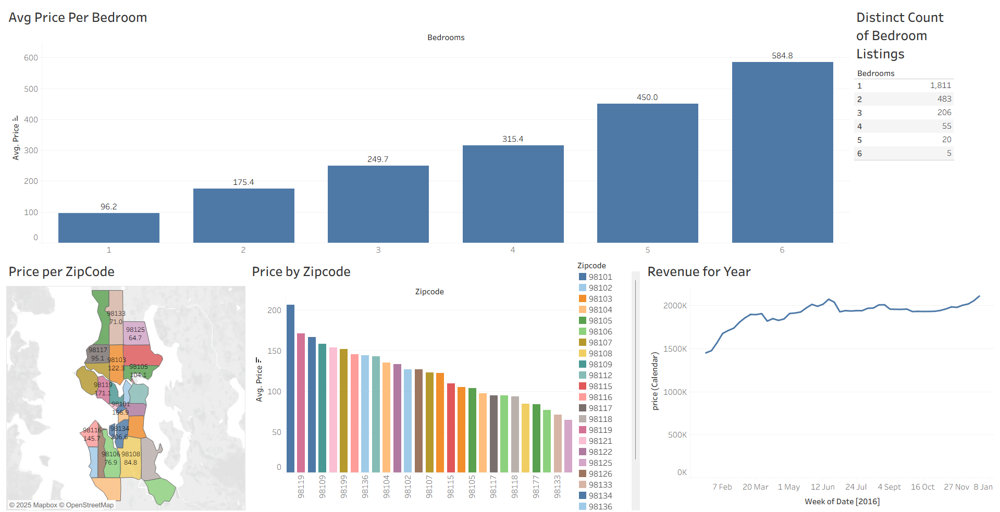

<div align="center">

#  Airbnb Market Insights - Seattle

[](https://python.org)
[](https://tableau.com)
[](https://pandas.pydata.org)
[](LICENSE)
[](https://github.com/amaninsights/airbnb-market-insights-seattle/actions)

**A production-grade analytics pipeline for Seattle Airbnb market analysis**

*Uncover pricing trends, seasonal patterns, and neighborhood insights from Seattle's short-term rental market*

[Features](#-features)  [Quick Start](#-quick-start)  [Architecture](#-architecture)  [Dashboard](#-tableau-dashboard)  [Key Findings](#-key-insights)

</div>

---

##  Overview

This project implements an **end-to-end analytics pipeline** that transforms Seattle Airbnb open data into actionable market insights. Built with production-grade practices:

-  Modular Python architecture with clean separation of concerns
-  Automated ETL pipeline with data validation
-  Interactive Tableau dashboard for visualization
-  Statistical analysis with scipy
-  CI/CD pipeline with GitHub Actions
-  Comprehensive unit tests with pytest

##  Features

| Feature | Description |
|---------|-------------|
|  **ETL Pipeline** | Ingest Kaggle CSV data into SQLite with automated cleaning |
|  **Neighborhood Analysis** | Ranking and comparison of 80+ Seattle neighborhoods |
|  **Price Prediction** | Statistical modeling and competitive positioning |
|  **Seasonal Trends** | Identify peak/off-peak patterns for pricing strategy |
|  **Auto Visualizations** | 8+ chart types generated automatically |
|  **Tableau Dashboard** | Interactive exploration of market dynamics |

##  Quick Start

### Prerequisites

- Python 3.9+
- [Seattle Airbnb Dataset](https://www.kaggle.com/datasets/airbnb/seattle) from Kaggle

### Installation

```bash
# Clone the repository
git clone https://github.com/amaninsights/airbnb-market-insights-seattle.git
cd airbnb-market-insights-seattle

# Install dependencies
pip install -r requirements.txt

# Download data from Kaggle and place in data/raw/
# Expected files: listings.csv, calendar.csv, reviews.csv
```

### Run the Pipeline

```bash
# Run full analysis
python main.py

# Generate all charts
python main.py --export-charts

# Show top 20 neighborhoods
python main.py --top 20

# Using make
make run            # Run pipeline
make charts         # Generate charts
make test           # Run tests
```

##  Project Structure

```
airbnb-market-insights-seattle/

  src/                          # Source code
     data/                     # Data processing
       loader.py                # Kaggle data ingestion
       transformer.py           # Cleaning & feature engineering
     analysis/                 # Analytics modules
       market_analysis.py       # Pricing, neighborhoods, seasonality
     visualization/            # Chart generation
       charts.py                # 8+ publication-ready visualizations
     utils/                    # Utilities
        logger.py                # Centralized logging

  tests/                        # Unit tests
    conftest.py                  # Pytest fixtures
    test_transformer.py          # Transformer tests
    test_market_analysis.py      # Analysis tests

  dashboard/                    # Tableau files
    Airbnb Dashboard.twb         # Tableau workbook
    Tableau Full Project.xlsx    # Data extract

  config/                       # Configuration
    config.yaml                  # Pipeline settings

  data/                         # Data directories
    raw/                         # Kaggle CSV files
    processed/                   # SQLite database

  reports/                      # Output
    figures/                     # Generated charts

  .github/workflows/            # CI/CD
    ci.yml                       # GitHub Actions

 main.py                          # Pipeline entry point
 pyproject.toml                   # Modern Python packaging
 Makefile                         # Automation commands
 README.md                        # This file
```

##  Architecture

```
          
   KAGGLE DATA           TRANSFORM              ANALYZE      
   (CSV Files)      (Python)         (Statistics)  
                                                             
   listings.csv         Cleaning             Pricing      
   calendar.csv         Features             Neighborhoods
   reviews.csv          Aggregation          Seasonality  
          
                                                        
                        
                                                               
                                   
                 VISUALIZE                             TABLEAU       
                 (Matplotlib)                          Dashboard     
                                                                     
                 Price maps                           Interactive  
                 Distributions                        Drill-down   
                 Comparisons                          Filters      
                                   
```

##  Tableau Dashboard



**Interactive Features:**
-  Geographic price heatmap
-  Neighborhood comparison charts
-  Room type distribution
-  Seasonal availability patterns
-  Price range filters

##  Key Insights

<table>
<tr>
<td width="50%">

###  Pricing Metrics

| Metric | Value |
|--------|-------|
| Total Listings | 3,800+ |
| Average Price | $137/night |
| Median Price | $109/night |
| Price Range | $20 - $1,000+ |

</td>
<td width="50%">

###  Top Findings

- **Capitol Hill** & **Downtown** command highest prices
- **Summer months** see 40% higher occupancy
- **Entire homes** dominate (65% market share)
- Top 10% of hosts own 30% of listings

</td>
</tr>
</table>

###  Top Neighborhoods by Average Price

| Rank | Neighborhood | Avg Price | Listings |
|------|-------------|-----------|----------|
| 1 | Southeast Magnolia | $248 | 45 |
| 2 | Portage Bay | $235 | 32 |
| 3 | Westlake | $219 | 28 |
| 4 | West Queen Anne | $195 | 156 |
| 5 | Downtown | $185 | 312 |

##  Testing

```bash
# Run all tests
pytest tests/ -v

# Run with coverage
pytest tests/ -v --cov=src --cov-report=html

# View coverage report
open htmlcov/index.html
```

##  API Reference

```python
from src.data.loader import AirbnbDataLoader
from src.data.transformer import AirbnbTransformer
from src.analysis.market_analysis import MarketAnalyzer
from src.visualization.charts import AirbnbCharts

# Load data
loader = AirbnbDataLoader("config/config.yaml")
listings = loader.load_listings()
calendar = loader.load_calendar()

# Transform
transformer = AirbnbTransformer(listings, calendar)
df = transformer.transform()

# Analyze
analyzer = MarketAnalyzer(df)
insights = analyzer.get_market_insights()
neighborhoods = analyzer.analyze_neighborhoods(top_n=10)

# Visualize
charts = AirbnbCharts(df)
charts.save_all_charts("reports/figures/")
```

##  Tech Stack

| Category | Technologies |
|----------|--------------|
| **Language** | Python 3.9+ |
| **Data** | Pandas, NumPy, SQLAlchemy |
| **Visualization** | Matplotlib, Seaborn, Tableau |
| **Statistics** | SciPy |
| **Testing** | pytest, pytest-cov |
| **CI/CD** | GitHub Actions |
| **Code Quality** | black, isort, flake8 |

##  Data Source

- **Dataset:** [Seattle Airbnb Open Data](https://www.kaggle.com/datasets/airbnb/seattle)
- **Contents:** Listings, calendar availability, reviews
- **Period:** 2016 (historical dataset)
- **License:** CC0: Public Domain

##  License

This project is licensed under the MIT License - see the [LICENSE](LICENSE) file for details.

##  Author

**Aman Saroha**

[](https://github.com/amaninsights)
[](https://linkedin.com/in/amaninsights)

---

<div align="center">

** Star this repo if you find it useful!**

*Part of my data analytics portfolio showcasing end-to-end project development*

</div>
